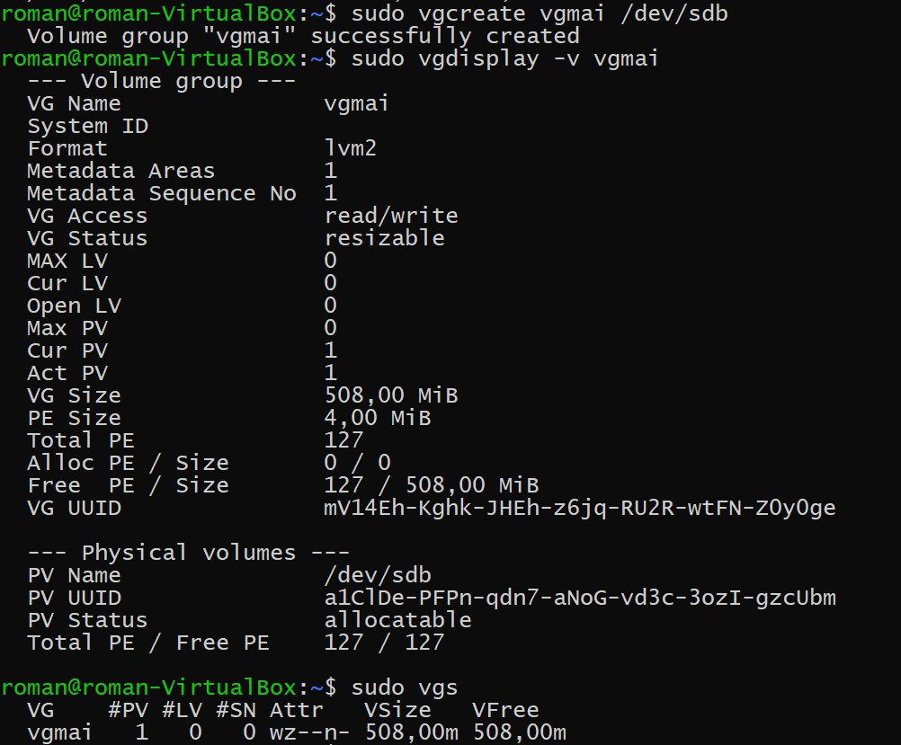
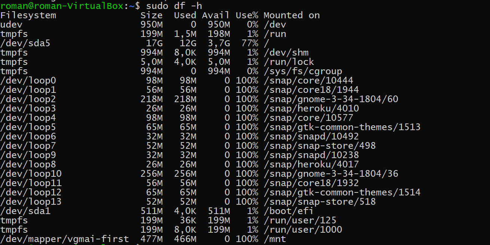
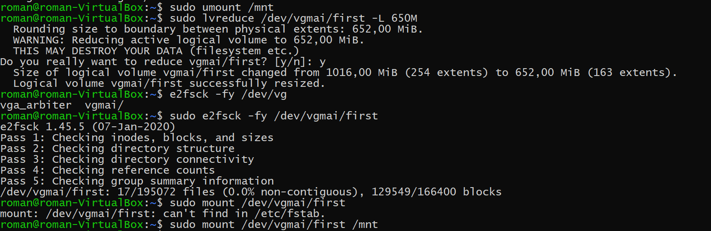
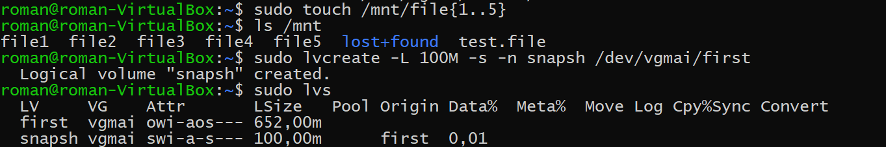
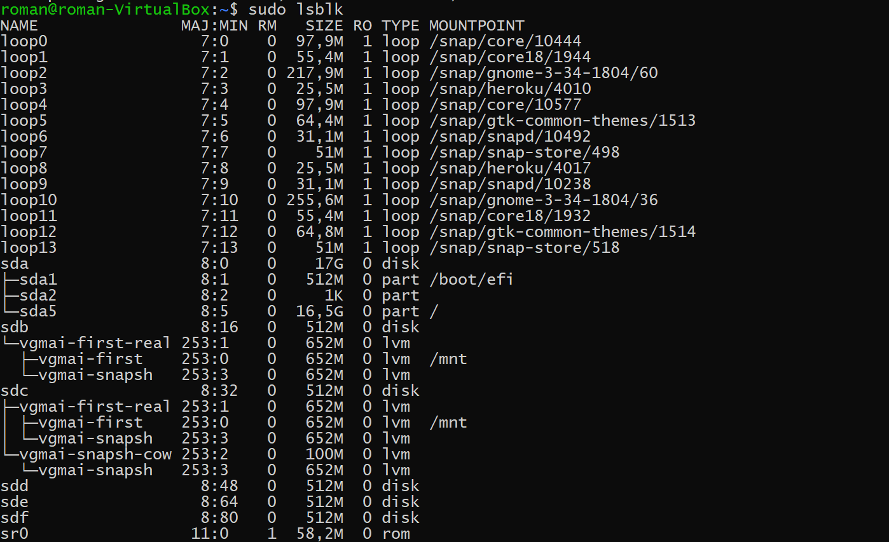
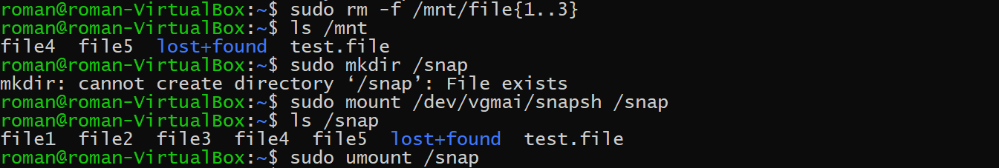
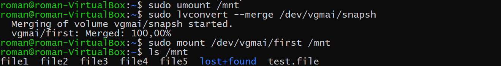
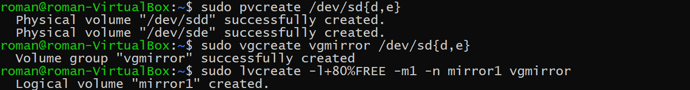
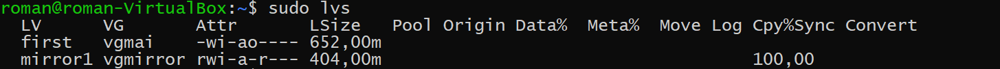

# linux-lab-5
## Работа с lvm
### Цель:
Практика c LVM
### Ход работы:
##### Были добавлены в систему 5 виртуальных дисков по 512 Mb каждый.
##### Установлена *lvm* командой `sudo apt install lvm2 -y`
##### Смотрим текущее состояние:
```
lsblk
sudo lvmdiskscan
```


##### Добавляем диск как PV:
```
sudo pvcreate /dev/sdb
sudo pvdisplay
sudo lvmdiskscan
sudo pvs
```


##### Создаём VG на базе PV
```
sudo vgcreate vgmai /dev/sdb
sudo vgdisplay -v vgmai
sudo vgs
```

##### Создаём LV на базе VG
```
sudo lvcreate -l+100%FREE -n first vgmai
sudo lvdisplay
sudo lvs
```

##### Создаём файловую систему, монтируем её и проверяем
```
sudo mkfs.ext4 /dev/vgmai/first
sudo mount /dev/vgmai/first /mnt
sudo mount
```


##### Создаём файл на весь размер точки монтирования
```
sudo dd if=/dev/zero of=/mnt/test.file bs=1M count=1500 status=progress
sudo df -h
```

##### Расширяем LV за счёт нового PV в VG
```
sudo pvcreate /dev/sdc
sudo vgextend vgmai /dev/sdc
sudo lvextend -l+100%FREE /dev/vgmai/first
sudo lvdisplay
sudo lvs
sudo df -h
```


##### Расширяем файловую систему
```
sudo resize2fs /dev/vgmai/first
sudo df -h
```

##### Уменьшаем файловую систему и LV
```
sudo umount /mnt
sudo fsck -fy /dev/vgmai/first
sudo resize2fs -f /dev/vgmai/first 650M
sudo mount /dev/vgmai/first /mnt
sudo df -h
```



##### Создаём несколько файлов и делаем снимок
```
sudo touch /mnt/file{1..5}
ls /mnt
sudo lvcreate -L 100M -s -n snapsh /dev/vgmai/first
sudo lvs
sudo lsblk
```


##### Удаляем несколько файлов
```
sudo rm -f /mnt/file{1..3}
ls /mnt
```
##### Монтируем снимок и проверяем, что файлы там есть. Отмонтируем.
```
sudo mkdir /snap
sudo mount /dev/vgmai/snapsh /snap
ls /snap
sudo umount /snap
```

##### Отмонтируем файловую систему и производим слияние. Проверяем, что файлы на месте.
```
sudo umount /mnt
sudo lvconvert --merge /dev/vgmai/snapsh
sudo mount /dev/vgmai/first /mnt
ls /mnt
```

##### Добавляем ещё PV, VG и создаём LV-зеркало.
```
sudo pvcreate /dev/sd{d,e}
sudo vgcreate vgmirror /dev/sd{d,e}
sudo lvcreate -l+80%FREE -m1 -n mirror1 vgmirror
```

##### Наблюдаем синхронизацию.
```
sudo lvs
```

